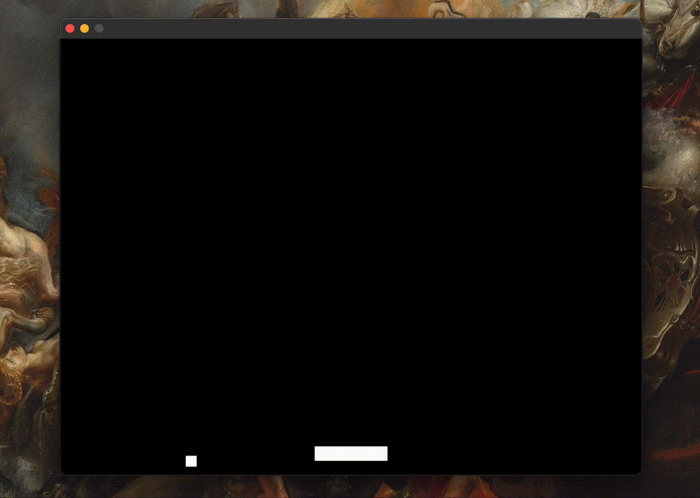
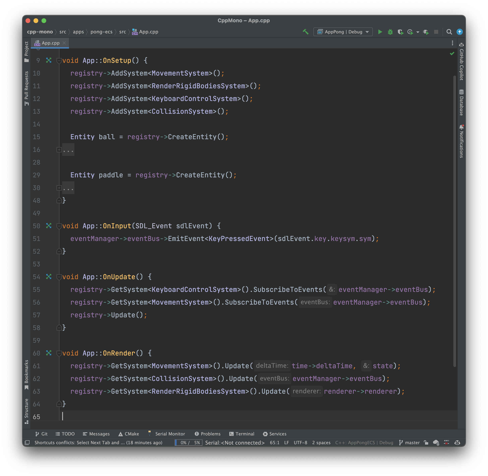

# CPP Monorepo

Collection of C++ projects that I created to learn C++ and CMake.

Project  structure is inspired by [nrwl/nx](https://github.com/nrwl/nx). There are 2 folders that developers have to worry about:

- `/src/apps` - all the apps that are part of the monorepo
- `/src/packages` - can be copy-pasted to another repository if necessary and in the long run should be served as `externals` libraries.

**Dependencies**

- `$ brew install cmake`
- `$ brew install sdl2`
- `$ brew install sdl2_ttf`
- `$ brew install sdl2_image`
- `$ brew install googletest`

**Tasks**

- [ ] write tests
- [ ] add more complicated examples

## Apps

### Pong

Minimal single player _pong_ game. It is supposed to test show how to create minimal application with game loop using `packages/loop-sdl`.  

### Pong ECS

Minimal single player _pong_ game same as `apps/pong` but uses `packages/ecs` to demonstrate how to write applications with entity, component, system architecture in mind.

## Packages

### ECS

Data oriented entity, component, system helpers. Mostly provided by [Pikuma 2D Game Engine tutorial](https://pikuma.com/courses/cpp-2d-game-engine-development).

### Loop

This package is supposed to make it easy to create game loop. You need to provide Tick, Renderer and EventManager classes implementation. Unfortunately, it only works with SDL right now because I didn't implement renderer abstraction yet. 

### Loop SDL

SDL game loop implementation for `packages/loop` package.

### Events

Custom event manager implementation. Mostly provided by [Pikuma 2D Game Engine tutorial](https://pikuma.com/courses/cpp-2d-game-engine-development).
